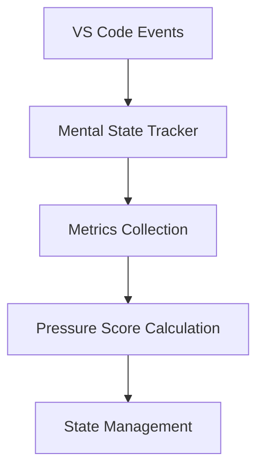
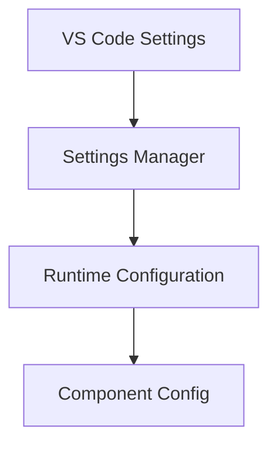
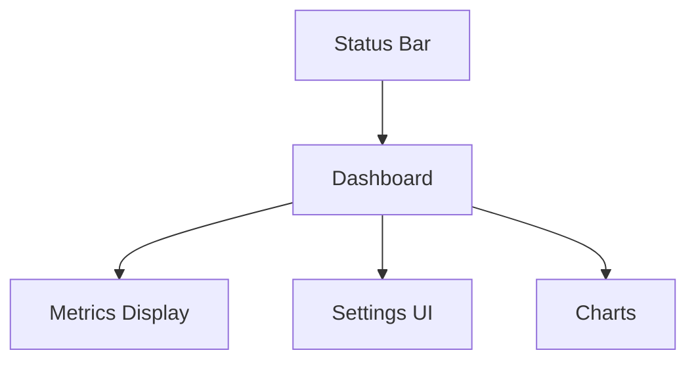

# Mental Load Balancer - Technical Architecture

## System Overview

Mental Load Balancer is built on a modular architecture with clear separation of concerns. The system consists of four main components that work together to provide intelligent cognitive load management.

## Core Components

### 1. Mental State Tracker


**Key Responsibilities:**
- Event monitoring
- Metric aggregation
- Pattern detection
- Score calculation

**Design Patterns:**
- Observer Pattern for event handling
- Strategy Pattern for metric calculations
- Singleton for state management

### 2. Intervention System


**Components:**
- Backoff Strategy: Manages intervention timing
- Joke Engine: Generates contextual content
- Notification System: Handles UI interactions

### 3. Configuration Management


**Features:**
- Dynamic settings updates
- Type-safe configuration
- Default value management
- Scope handling (user/workspace)

### 4. UI Components


## Data Flow

### 1. Event Processing
```sequence
VS Code->Mental State Tracker: Editor Events
Mental State Tracker->Metrics Collector: Raw Metrics
Metrics Collector->Score Calculator: Processed Metrics
Score Calculator->State Manager: Pressure Score
```

### 2. Intervention Flow
```sequence
State Manager->Backoff Strategy: Check Timing
Backoff Strategy->Intervention Manager: Allow Intervention
Intervention Manager->Joke Engine: Get Content
Joke Engine->UI Manager: Show Notification
```

## State Management

### Mental State Metrics
\`\`\`typescript
interface MentalStateMetrics {
    debuggingDuration: number;
    fileContextSwitches: number;
    errorPatterns: ErrorPattern[];
    timeOfDay: number;
    workSessionDuration: number;
}
\`\`\`

### Pressure Score Calculation
1. Individual Metrics Processing
   ```typescript
   interface MetricScore {
       value: number;
       weight: number;
       category: string;
   }
   ```

2. Weighted Aggregation
   ```typescript
   type PressureScore = {
       total: number;
       factors: Record<string, number>;
   }
   ```

## Performance Considerations

### 1. Event Debouncing
- Keystroke events: 100ms
- File changes: 250ms
- Metric calculations: 1000ms

### 2. Memory Management
- Metric history: Rolling window
- Cache invalidation: 5 minutes
- Event listener cleanup

### 3. CPU Usage
- Batch calculations
- Lazy evaluation
- Background processing

## Security

### 1. Data Privacy
- Local processing only
- No external API calls
- No telemetry collection

### 2. Workspace Isolation
- Separate state per workspace
- Isolated configuration
- No cross-window sharing

## Error Handling

### 1. Graceful Degradation
```typescript
try {
    // Critical operation
} catch (error) {
    // Fallback behavior
    logger.warn('Falling back to default behavior', error);
}
```

### 2. Recovery Strategies
- Component isolation
- State reset capabilities
- Automatic retry with backoff

## Testing Strategy

### 1. Unit Tests
- Individual component testing
- Mock VS Code API
- Isolated state testing

### 2. Integration Tests
- Component interaction
- Event handling
- UI updates

### 3. E2E Tests
- Full workflow testing
- VS Code extension tests
- UI interaction tests

## Extensibility

### 1. Plugin System
```typescript
interface MetricProvider {
    getName(): string;
    calculateMetric(): number;
    getWeight(): number;
}
```

### 2. Custom Interventions
```typescript
interface InterventionStrategy {
    shouldTrigger(state: MentalState): boolean;
    getContent(): Promise<string>;
    display(content: string): void;
}
```

## Configuration Schema

```json
{
    "mentalLoadBalancer": {
        "metrics": {
            "weights": {
                "debugging": 0.3,
                "contextSwitch": 0.2,
                "errors": 0.2,
                "timeOfDay": 0.15,
                "keystrokes": 0.15
            }
        },
        "backoff": {
            "baseInterval": 5,
            "maxInterval": 60,
            "factor": 2
        },
        "ui": {
            "statusBar": true,
            "notifications": "popup"
        }
    }
}
```

## Future Considerations

### 1. Machine Learning Integration
- Pattern recognition
- Personal preferences learning
- Adaptive thresholds

### 2. Team Integration
- Shared break scheduling
- Team load visualization
- Collaborative features

### 3. API Extensions
- Third-party metric providers
- Custom intervention types
- External integrations

## Performance Metrics

### 1. Response Time
- Event processing: < 50ms
- Score calculation: < 100ms
- UI updates: < 16ms

### 2. Resource Usage
- Memory: < 50MB
- CPU: < 1% average
- Storage: < 1MB

## Deployment

### 1. Packaging
```bash
vsce package
```

### 2. Distribution
- VS Code Marketplace
- GitHub Releases
- Automatic updates

## Version Control

### 1. Branch Strategy
- main: stable releases
- develop: integration
- feature/*: new features
- fix/*: bug fixes

### 2. Version Scheme
- Semantic Versioning
- Release tags
- Changelog automation